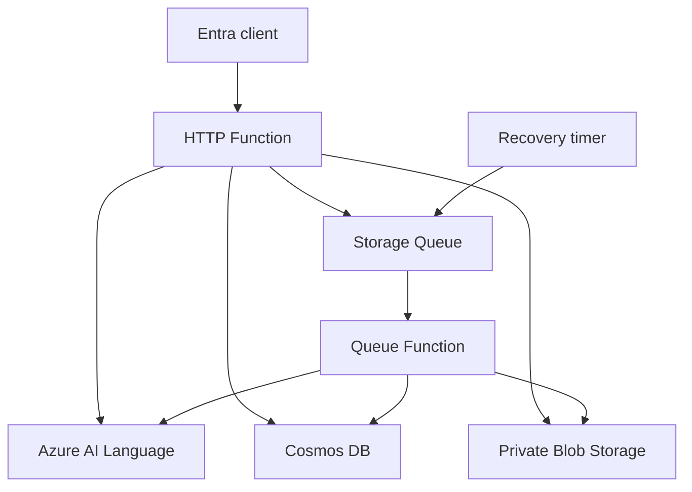

# Azure Sentiment Analysis Service

Azure Functions service for individual text and collections of customer feedback. It ports the behavior of [sentiment_analysis_lambda](https://github.com/rclevenger-hm/sentiment_analysis_lambda) to Azure, including the bulk/reporting features introduced at source commit `4c6bd13`.

## Features

- Single text analysis with positive, negative, neutral, or mixed sentiment.
- CSV/JSON uploads: 200 records, 1 MiB per request, 5,000 UTF-8 bytes per text, stable record IDs and per-record validation errors.
- Optional English opinion mining, aspect evidence, assessment polarity and negation, source offsets, and bounded excerpts.
- Resumable jobs, progress, caller-scoped history, metadata filters, daily trends, comparisons, and CSV/JSON exports.
- Negative-feedback rules, evidence record IDs, persistent alert feed, and acknowledgement.
- Entra access tokens, signed-token verification, tenant isolation, atomic quotas, per-minute request limits, private storage and managed identities.
- Terraform with remote state, OIDC deployment, retention, Application Insights, error alarms, and resource-group budgets.

## Architecture

Functions v4 / Node.js 24 on Flex Consumption. Cosmos partitions by a hash of the verified directory and object ID. Job creation and quota reservation commit in one transaction. Worker checkpoints publish immutable blob pointers and alerts in one transaction; expired workers cannot overwrite a newer result.

